# Adoucisseur sous Home-assistant

> Remontée état adoucisseur et niveau sel par MQTT sous Home-assistant

## Adoucisseur

Modèle **CR2J FMB 20** à commande mécanique

[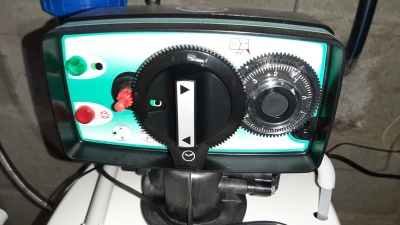](./images/2021_0907_133732_1.jpg)

<br>

## Matériels

### Wemos D1 Mini

[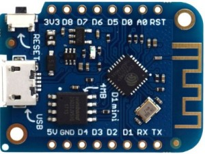](./images/wemos-d1-mini-esp-8266ex-4mb-flash.jpg)

**Wemos D1 Mini**, module à base d'**esp8266**

<br>

### Module mesureur de distance **GP2Y0A02** de Sharp

[](./images/Sharp-GP2Y0A02_1.png)

Le **GP2Y0A02YK0F** de Sharp est un capteur de mesure de distance. 
Ce capteur donne une tension proportionnelle à la distance mesurée

    Plage de mesure de distance de 20cm à 150cm
    Sortie analogique
    Taille de boîtier 29.5mm x 13mm x 21.6mm
    Consommation de courant typique de 33mA
    Tension d'alimentation de 4,5V à 5,5V

Ce capteur permettra de mesurer la hauteur du bac à sel.

<br>

### LDR

[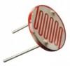](./images/ldr-photoresistor.jpg)

La **LDR** est placée devant le voyant rouge qui s'allume lors de la régénération de la résine.
Elle doit etre protégée de la lumière ambiante.

<br>

### Module ADC ADS1115

[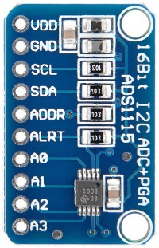](./images/ADS1115_ADC_Module_16b_4canaux_1.jpg)

**ADS1115**, convertisseur ADC 16 bits, 4 canaux I2c

* **Sharp-GP2Y0A02** (Niveau sel) relié sur A0
* **LDR** sur temoin rouge (Statut adoucisseur) reliée sur A1


<br>

## Cablâge

[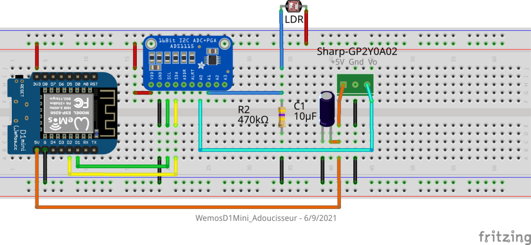](./images/WemosD1Mini-Adoucisseur_bb.png)


<br>

## Code Arduino

* [WemosD1Mini_Adoucisseur.ino](./WemosD1Mini_Adoucisseur.ino)

Le programmme sur le **Wemos** fonctionnera de cette façon:

- Configuration Wifi
- Configuration OTA (pour mise à jour par le Wifi)
- Configuration MQTT
- Boucle principale qui va lire les 2 senseurs à intervalle régulier et les envoyer sur le bus MQTT

Le code Arduino utilise la fonctionnalité **MQTT discovery** pour intégrer automatiquement au boot du **Wemos D1 Mini** les 2 senseurs **Statut régénération** 
et **Niveau sel** dans **Home-assistant**

Le Wemos va apparaitre directement en tant que **Appareil (device)** dans la configuration **Home-assistant**

<br>

### Menu **Configuration/Appareils**

[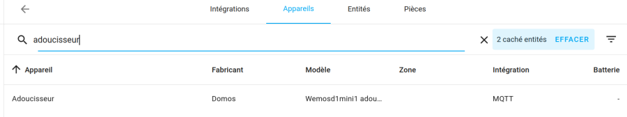](./images/ha_device_adoucisseur_0.png)

<br>

### Page "Adoucisseur" dans  **Configuration/Appareils**

[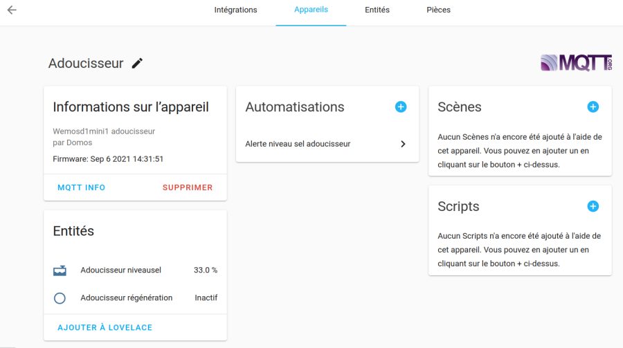](./images/ha_device_adoucisseur_1.png)

<br>

### Menu "MQTT Info" dans **Configuration/Appareils Adoucisseur**

[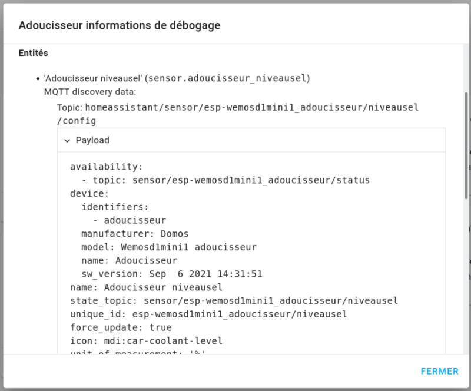](./images/ha_device_adoucisseur_2.png)

<br>

### Dashboard

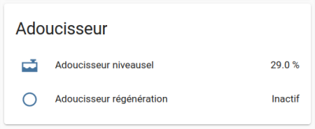](./images/ha_device_adoucisseur_3.png)

<br>

## Photos

Montage en test sur l'adoucisseur

### Montage "en volant" sur l'adoucisseur

La **LDR** est placée dans un tube électrique IRL pour etre protégé de la lumière ambiante.

[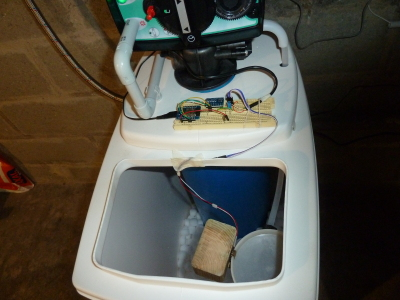](./images/2021_0513_125937_1.jpg)

<br>

### Détecteur de niveau de sel

[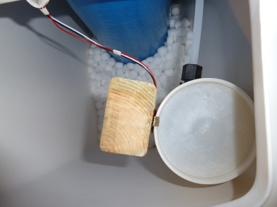](./images/2021_0513_125949_1.jpg)

[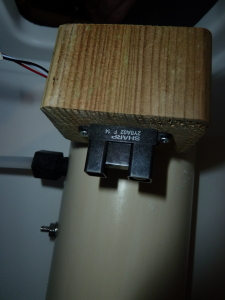](./images/2021_0513_130007_1.jpg)

<br>

### Montage sur platine d'essai

[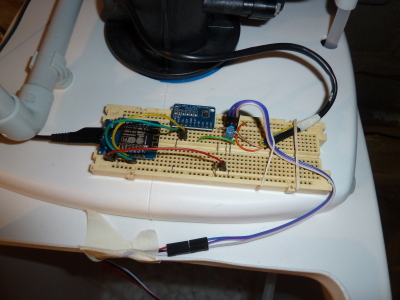](./images/2021_0513_130018_1.jpg)

<br>

## Vue sur graphe

### *Add-on* **Grafana** et **MariaDB**

Grafana est configuré avec la base homeassistant MariaDB (*recorder* sur 30j) en *Data Source* et avec cette requete SQL pour afficher le graphe 
(le paramètre **Query Option/Relative Time** est forcé à 30d => 30 jours)

```sql
SELECT UNIX_TIMESTAMP(CONVERT_TZ(last_updated,'+00:00','+02:00')) as time_sec,
  if(state = 'on', 1, 0) as value,
  "Régénération" as metric
FROM `states`
WHERE entity_id="binary_sensor.adoucisseur_regeneration" AND state!="unavailable" AND $__timeFilter(last_updated)
ORDER BY last_updated ASC;
```

<br>

### Vue sur *dashboard* Home-assistant

[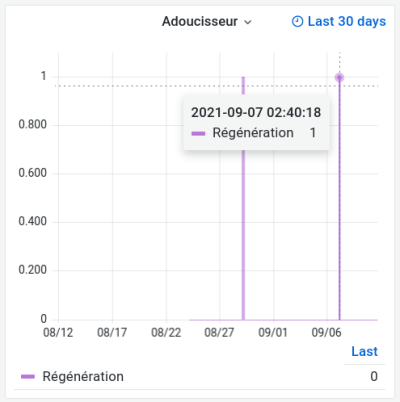](./images/ha_grafana_adoucisseur_0.png)

A voir avec **InfluxDB** comme *Data Source*, l'affichage semble plus rapide.


<br>

## Automation

Notification si niveau sel inférieur à 10%

```yaml
alias: Alerte niveau sel adoucisseur
description: ''
trigger:
  - platform: numeric_state
    below: '10'
    for: '1800'
    entity_id: sensor.adoucisseur_niveausel
condition: []
action:
  - service: shell_command.notify_whatsapp
    data:
      message: Niveau sel adoucisseur faible le {{ now().strftime('%d-%m-%Y %H:%M') }}
      destinataire: domos
mode: single
```

<br>

